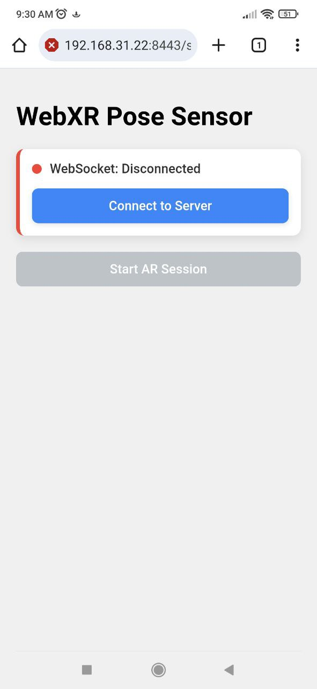
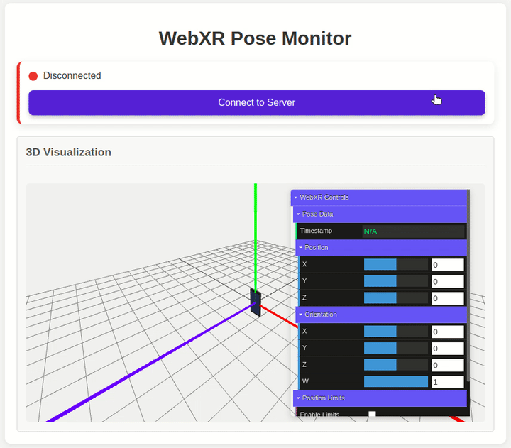

# WebXR API Server with ROS2 Integration

A streamlined server that captures pose data (position and orientation) from mobile AR sessions (using WebXR API) and makes it available through WebSocket and ROS2 topics. The server publishes pose data to ROS2 topics for seamless integration with robotics applications.

<table>
<tr>
<td></td>
<td></td>
</tr>
</table>

*Mobile AR interface (left) and real-time 3D visualization (right)*

## Requirements

- Python 3.7+
- ROS2
- Mobile device with WebXR API support (most modern Android/iOS devices)
- Both server and client on the same network

## Testing WebXR Support

To check if your device supports WebXR:
1. Visit https://immersive-web.github.io/webxr-samples/ 
2. Or use the included test page at `https://<your-ip>:8443/static/webxr_test.html` (after running the server)

## Quick Setup

1. Clone the repository:
   ```bash
   git clone https://github.com/sudhirpratapyadav/webxr_api_server.git
   cd webxr_api_server
   ```

2. Install required packages:
   ```bash
   pip install -r requirements.txt
   ```

3. Set up HTTPS (required for WebXR):
   ```bash
   ./setup_https.sh
   ```

5. Run the server:
   ```bash
   python run_server.py
   ```

   The server will automatically detect if ROS2 is available and enable integration.

### Accessing the web app

Once the server is running, you can access:

- Main interface: `https://<your-ip>:8443/static/index.html`
- Visualization GUI: `https://<your-ip>:8443/static/gui.html`
- WebXR test page: `https://<your-ip>:8443/static/webxr_test.html`

The server will display your IP address when it starts. For example:
```
🚀 Starting HTTPS server with ROS2 integration
   Address: 192.168.31.22:8443
📱 Access URLs:
   - Main App: https://192.168.31.22:8443/static/index.html
   - WebXR Test: https://192.168.31.22:8443/static/webxr_test.html
   - Pose Monitor: https://192.168.31.22:8443/static/gui.html
   - Server Info: https://192.168.31.22:8443/server-info
   - ROS Info: https://192.168.31.22:8443/ros-info
🤖 ROS2 Integration:
   - Topic: /webxr/pose (geometry_msgs/PoseStamped)
   - Node: webxr_pose_publisher
   - Test with: ros2 topic echo /webxr/pose
```

## Important Notes

- You will see security warnings about the self-signed certificate in your browser
- Click "Advanced" and then "Proceed" to continue
- For mobile devices, you need to first open the URL in your browser and accept the security warning
- Both your computer and mobile device must be on the same network

## ROS2 Integration

When ROS2 is available, the server automatically publishes pose data to ROS2 topics:

### ROS2 Topic Information
- **Topic**: `/webxr/pose`
- **Message Type**: `geometry_msgs/PoseStamped`
- **Node Name**: `webxr_pose_publisher`
- **Frame ID**: `webxr_frame`

### ROS2 Message Format

The pose data is published as `geometry_msgs/PoseStamped`:
```
header:
  stamp:
    sec: 1718889296
    nanosec: 789000000
  frame_id: webxr_frame
pose:
  position:
    x: 0.0000
    y: 1.6000
    z: 0.0000
  orientation:
    x: 0.0000
    y: 0.0000
    z: 0.0000
    w: 1.0000
```

## GUI Visualization

The server includes a 3D visualization interface accessible at `https://<your-ip>:8443/static/gui.html`. This interface:

- Displays the a smartphone whose pose is updated in real-time via WebSocket connection
- UI panel for displaying pose values and some other controls
- Includes interactive camera controls (pan, zoom, rotate)


## API Endpoints

The server provides multiple APIs for accessing pose data and system information:

1. **WebSocket API**: Real-time pose streaming at `wss://<your-ip>:8443/ws`

2. **REST API**: Get the latest pose data with `https://<your-ip>:8443/latest_pose`

3. **Server Info**: Check server status with `https://<your-ip>:8443/server-info`

4. **ROS Info**: Check ROS2 integration status with `https://<your-ip>:8443/ros-info`


## Architecture and Flow Diagrams

For detailed architecture, sequence, data flow, and error handling diagrams, see [diagrams.md](docs/diagrams.md).

## Repository Structure

```
.
├── README.md               # This documentation file
├── requirements.txt        # Python dependencies
├── run_server.py           # Script to start HTTPS server
├── server.py               # Main FastAPI server implementation
├── setup_https.sh          # Script to generate self-signed certificates
├── certs/                  # Directory for SSL certificates
│   ├── cert.pem            # Self-signed certificate
│   └── key.pem             # Private key for the certificate
├── docs/                   # Documentation and media files
│   ├── diagrams.md         # Architecture and flow diagrams
│   ├── pose_sensor.jpg     # Mobile AR client demo screenshot
│   └── pose_viewer.gif     # GUI visualization demo
└── static/                 # Static web files
    ├── favicon.ico         # Favicon for the web app
    ├── gui.html            # 3D visualization interface
    ├── index.html          # Main web interface
    ├── teleop_client.js    # WebXR client JavaScript code
    └── webxr_test.html     # WebXR compatibility test page
```