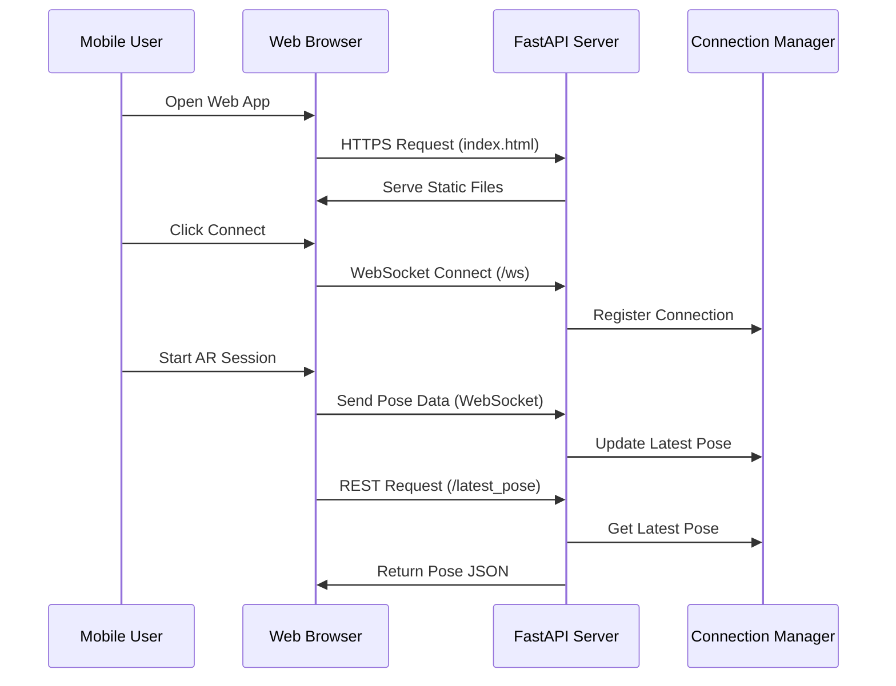
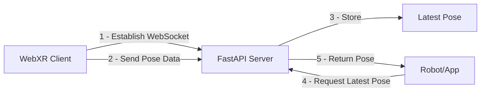
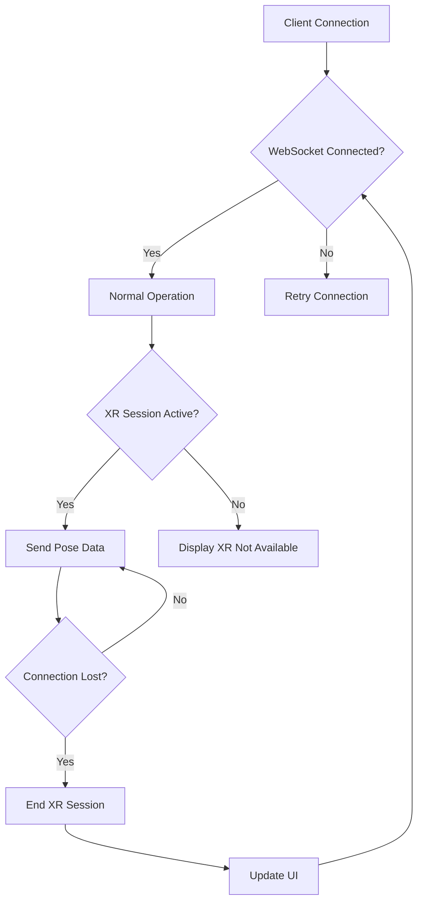

# WebXR API Server Diagrams

## Architecture Diagram

```mermaid
graph TD
    subgraph Client Side
        A[Mobile Device<br>WebXR Client]
        B[Web Browser]
        L[DOM Overlay UI]
    end
    
    subgraph Server Side
        C[FastAPI Server]
        D[Connection Manager]
        E[REST API]
        F[WebSocket API]
        G[Static File Server]
    end
    
    subgraph HTTPS Layer
        H[Uvicorn HTTPS]
        I[Self-signed Certs]
    end
    
    subgraph Storage
        J[Latest Pose Memory]
    end

    A -- WebXR API --> B
    B -- DOM Overlay --> L
    B -- HTTPS/WebSocket --> H
    H -- forwards --> C
    C -- serves --> G
    C -- REST /ws --> F
    C -- REST /server-info --> E
    C -- REST /latest_pose --> E
    C -- manages --> D
    D -- stores --> J
    I -- enables --> H
```

## Sequence Diagram

## Data Flow Diagram

## Error Handling Flow

## Notes

- **HTTPS** is required for WebXR API access on most devices.
- **WebSocket** provides real-time pose streaming; REST API gives latest snapshot.
- **Connection Manager** tracks clients and latest pose.
- **Static files** serve the web client and test page.
- **Self-signed certificates** are used for local development.
- **DOM Overlay** provides UI controls within the AR experience.
- **Data Format:**
  - JSON with timestamp, position (x, y, z), orientation (x, y, z, w quaternion).
- **Error Handling:**
  - Connection failures are detected and reported
  - WebXR compatibility is checked before enabling AR
  - WebSocket connections are monitored and cleaned up if disconnected