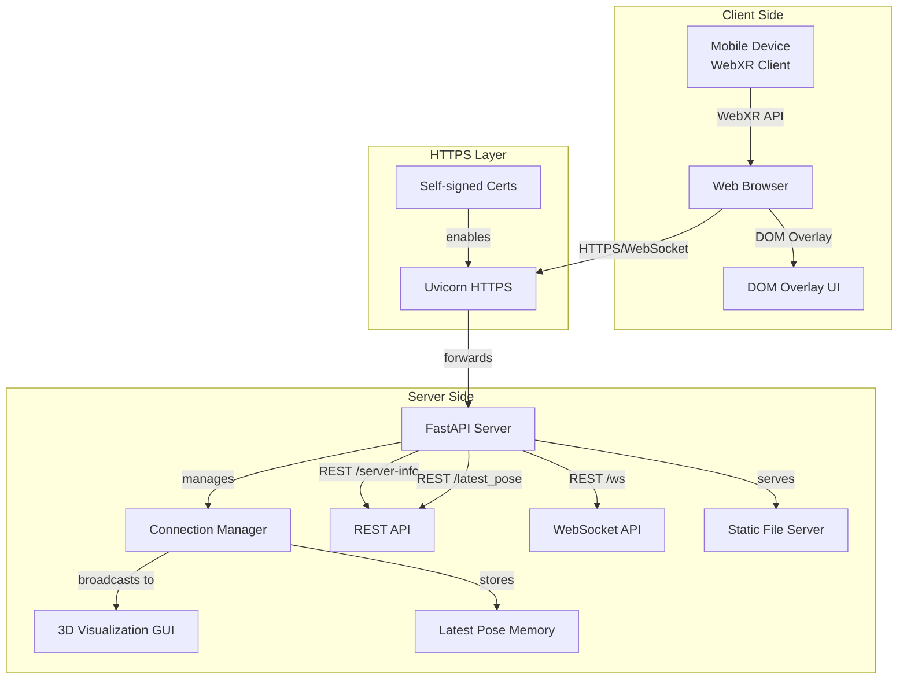
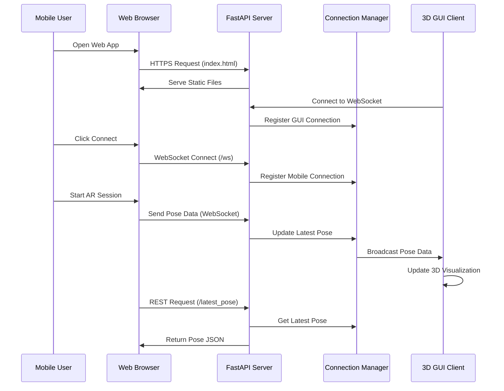
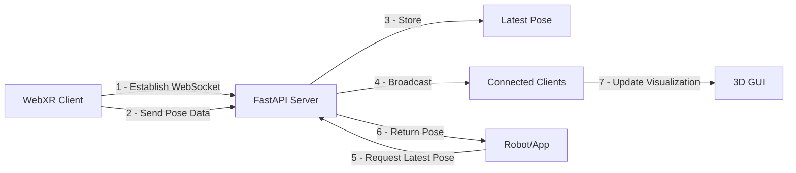
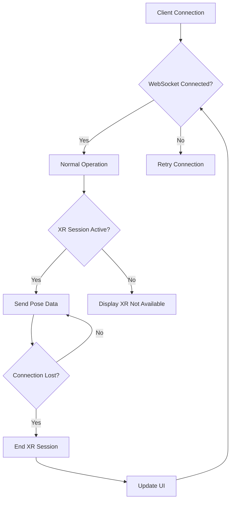

# WebXR API Server Diagrams

## Architecture Diagram

## Sequence Diagram

## Data Flow Diagram

## Error Handling Flow

## Notes

- **HTTPS** is required for WebXR API access on most devices.
- **WebSocket** provides real-time pose streaming and broadcasting to all connected clients.
- **Connection Manager** tracks clients, broadcasts data, and maintains latest pose.
- **Static files** serve the web client, 3D visualization, and test pages.
- **Self-signed certificates** are used for local development.
- **DOM Overlay** provides UI controls within the AR experience.
- **3D Visualization** renders pose data in a three-dimensional scene with interactive controls.
- **Data Format:**
  - JSON with timestamp, position (x, y, z), orientation (x, y, z, w quaternion).
- **Error Handling:**
  - Connection failures are detected and reported
  - WebXR compatibility is checked before enabling AR
  - WebSocket connections are monitored and cleaned up if disconnected